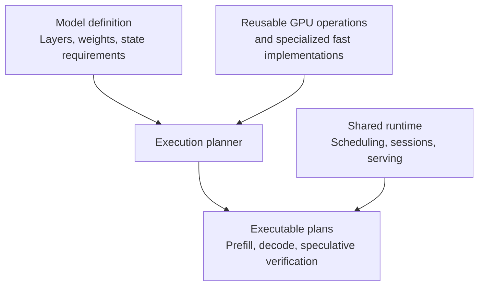

# Gufo model modularity: redesign ideas

Status: partially implemented on `experiment01` (2026-10-02). Changes 3–5 are
substantially done; changes 1–2 are started at the scalar-op and dispatch
level, with the GPU execution planner still future work. See
[docs/plans/model-modularity.md](docs/plans/model-modularity.md) for the
implementation log and measured validation results.

Gemma 4 31B is now an implemented package using both supplied Unsloth QAT and
conventional artifact sets. Text, window state, assistant/MTP and vision pass
independent numerical and native state checks for both. API coverage and retained
measurements are recorded in [the Gemma implementation log](docs/plans/gemma4.md).
The initial contract is one session and a 4K context; broader variants and the
cross-model GPU planner remain separately validated work.

Legend used below: ✅ done · 🟡 partially done · ⬜ not started.

A deeper redesign could make adding models substantially easier. The biggest
change would be to separate **the model's mathematical definition** from **the
machinery that executes it efficiently on Strix Halo**.

Gufo already has a useful serving boundary in
[`TextModelRunner`](src/cli/serve/text_model_runner.hpp). Extending that separation
down into execution would let a model author mostly describe layers, weights and
state requirements.

Conceptually:

The redesign would center on five changes.

**1. Make architectures compositions of reusable operations.**

A model definition would assemble operations such as embeddings, normalization,
attention, recurrent updates, dense or expert feed-forward layers, and output
projections.

Gemma could express its alternating attention types and normalization placement.
Qwen could express its combination of recurrent and attention layers. Each would
have its own small architecture implementation, using shared components.

These definitions could be ordinary C++ code that builds an execution graph. The
definitions must preserve precise mathematical details: attention masks,
positional encoding, scaling, activation variants and accumulation precision.
Those details determine whether reuse is correct.

Once an operation exists, later architectures using it can reuse that support.

🟡 Started: `src/models/common/ops/` holds canonical scalar ops (RMSNorm,
L2Norm, Sigmoid, SiLU, Softplus, SwiGLU, Softmax, NeoX RoPE) with an exactness
contract (`ops/README.md`) and analytic tests. The Flash-Next CPU oracle
forwards to them, pinned bit-exact by recorded checksums. Two deliberate
non-adoptions are documented: Qwen's norm uses a float64-epsilon variant and
its reference SiLU uses divide-form `x/(1+exp(-x))` vs multiply-form, which
round differently. Composing whole architectures from reusable ops (the graph
level above scalar math) is still future work.

**2. Put performance specialization behind those operations.**

The execution planner would select implementations according to tensor shapes,
quantization, hardware and workload:

- Matrix-vector kernels for individual-token decoding.
- Matrix-matrix kernels for prompt processing and larger batches.
- Fused kernels where combining operations saves memory traffic.
- Specialized implementations for particular blocks or architectures.

Most selection and memory planning would happen at model load or when preparing a
new batch shape. The resulting plan could use Gufo's existing style of HIP graph
capture.

This creates a useful progression: a new architecture can first run through
correct, general implementations, then receive targeted optimizations. A
hand-tuned whole-block implementation would remain an option where it provides a
measured benefit.

That preserves room for Gufo's hardware-specific work. Moving kernels behind an
interface alone would not guarantee equal performance; execution plans would
still need measurement.

🟡 Started, GPU side deferred: per-model HIP kernels stay model-private (no
cross-model GPU reuse, per blast-radius policy). `bench --generic` routes
through the registered package and exercises its existing runner, including
any optimized kernels it uses. It is a common integration path, not an
independent numerical reference or a separate unoptimized backend. A shape/dtype dispatching GPU
backend is intentionally deferred until a second model needs the same op —
building the dispatcher before then would be speculative generality.

**3. Treat inference state as a core abstraction.**

This is probably the hardest and most valuable part.

Different architectures maintain different kinds of state:

| State | What the runtime needs to understand |
|---|---|
| Full-attention KV cache | Append, share prefixes, restore positions |
| Sliding-window cache | Eviction and recovery of overwritten entries |
| Recurrent state | Checkpoints of accumulated state |
| Speculative decoding state | Commit accepted tokens and undo rejected work |
| Multimodal context | Encoded inputs, positions and their relationship to tokens |

The shared runtime would manage memory budgets, lifetimes and scheduling. State
components would implement their own restore, fork and rollback behavior.

For example, rewinding a recurrent layer requires restoring its accumulated
state. Merely changing the token position is insufficient. Making that contract
explicit would let scheduling and speculative decoding support grow without
repeatedly embedding architecture knowledge in the server.

✅ Contract foundation done: the contract is documented on `TextModelRunner` itself
(`src/cli/serve/text_model_runner.hpp`) — token-count positions, immutable
exact snapshots, restore-means-restore, speculative commit/rollback inside the
runner with byte-identical greedy output, multimodal identity in the prompt
context, honest capability advertisement — with behavioral checks in the
validation harness (change 5). Each new model still needs tests of its actual
state transitions, including eviction and rollback boundaries; documenting the
contract does not implement these capabilities for it.

**4. Give every model a complete integration package.**

A model package would contain:

- Architecture definition and configuration validation.
- Weight-name mapping, tensor transformations and format requirements.
- Tokenizer, prompt formatting and output parsing.
- Optional vision components and draft-model integration.
- Capability declarations and reference fixtures.

One registration would expose that package to `serve`, `prompt` and `bench`.

✅ Text integration foundation done: `TextModelPackage`
(`src/models/common/model_package.hpp`) + `TextModelRegistry` provide name, architectures,
`ValidateTemplate`, `NativeContext`, `ValidateLoadOptions`, `Load` — with
the Qwen/DeepSeek/Flash-Next runners moved into per-model
`serve_runner.cpp` files and `inference_backend.cpp` slimmed from ~3,500 to
~700 lines as a thin dispatcher. `bench --generic` / `prompt --generic`
work through registration alone.

Output parsing deserves particular attention. At the time of this review, Gufo's
shared inference code contains reasoning accounting based on `</think>`. A broader
design would let the model package interpret its delimiters and emit common
events such as text, reasoning and tool calls. The HTTP layer would serialize
those events. See the
[current inference backend](src/cli/serve/inference_backend.cpp).

🟡 Partial via `OutputDialect`: each package declares its reasoning delimiters
and enables the existing Qwen/DSML tool-call parsers in its runner descriptor;
`openai_chat.cpp` consumes these settings (defaults preserve today's behavior,
covered by dialect parity tests). This is not yet an arbitrary model-owned
output parser. Gemma's different tool syntax will require an extension, with
streaming tests, before tool support can be advertised. Prefer a package-owned
parser producing common events over accumulating model branches in HTTP code.

Generic prompting now forwards image attachments through package-owned
`PreparePrompt`. Gemma demonstrated one additional shared boundary:
`TextPromptContext::PrefillBoundary` keeps bidirectional image blocks atomic
when scheduling prefill or capturing cache checkpoints. Keep ordinary text
dispatch registration-driven, but allow small shared-interface changes when a
new capability demonstrates the need.

Weight storage would also be separate from architecture: supporting a model's
math and supporting a particular quantization are distinct capabilities.

**5. Make validation part of the model integration interface.**

Each package would provide fixtures for a common harness: tokenization, prompt
rendering, reference logits, perplexity, state restoration and streaming behavior.

That makes addition easier in a practical sense: a developer gets a repeatable way
to establish correctness and locate the first divergent layer. Optimized
implementations would be checked against independent references, with explicit
numerical expectations.

✅ Behavioral harness foundation done: `src/models/common/validate/` drives tokenize determinism,
render-and-tokenize, single-vs-multi decode equivalence, and
snapshot/restore fidelity purely through the package interface, reporting
the first divergent check by name. Flash-Next passes 4/4 on real weights
with MTP. Full-logit numerical truth deliberately stays model-specific:
`bench --logit-eval` remains a per-model harness (generalizing it would
force every model into one numerical frame), and the refactor was proven by
bit-identical full logits vs the pre-refactor binary (1664 rows × 2
schedules, hash-equal).

These checks are necessary but not an independent correctness oracle: two
incorrect decode paths can agree. A new architecture needs tokenizer/template
goldens and numerical evidence from a separate implementation using the same
artifacts. Generic bench rejects unsupported logit-evaluation options; use a
model-specific numerical harness instead.

With those foundations, the work for a new model would look like this:

| New model introduces... | Expected work |
|---|---|
| Different sizes of an existing architecture | Configuration, weight mapping and validation |
| A new arrangement of supported operations | Architecture definition and protocol integration |
| A genuinely new mathematical operation | That operation, its state behavior and a backend implementation |
| New performance bottlenecks | Targeted kernel or execution-plan tuning |

There are established precedents for both parts of this design: vLLM encourages
architecture implementations to reuse shared attention and expert layers, while
TVM separates model representation from hardware translation. See the
[vLLM integration guide](https://docs.vllm.ai/en/latest/contributing/model/basic/)
and [TVM architecture](https://tvm.apache.org/docs/arch/index.html).

The preferred target would be **a compact inference runtime with composable model
definitions and replaceable optimized implementations**. For Gemma, success would
mean most new code lives in its model package, with shared-engine changes limited
to genuinely missing operations or state capabilities. That is an achievable
architectural objective; automatic support for every future model would remain
beyond what such a redesign can promise.

## Remaining work (in suggested order)

1. ✅ Prove the package with a new architecture: Gemma 4 31B is implemented
   through registration at one session/4K context for both supplied sets.
   Target, assistant and vision math remain in 3082 model-private source lines.
   Shared changes are image forwarding/atomic cache boundaries, registration,
   and a coalesced reasoning-delimiter fix. See the implementation log.
2. ✅ Separate architecture from supported weight storage during the port.
   Tensor names, shapes, storage types, conversion assumptions, tokenizer and
   sidecar identities are validated explicitly. Both supplied sets have
   independent numerical baselines; no universal weight abstraction is added.
3. 🟡 Develop reusable GPU operations and architecture composition together,
   driven by the working Gemma implementation. Extract an operation only when
   two models need matching semantics and parity/performance proofs exist.
   Keep model-private kernels until then. Build shape/dtype selection and
   execution-graph planning incrementally rather than designing a complete
   planner before the second implementation provides evidence.
   Gemma target/vision share qualified private FP32 norm/GELU/BLAS helpers.
   Bounded shape/mask rules and the first cross-model FP32 GEMM candidate are
   recorded in [EXPERIMENTS.md](docs/models/gemma4/EXPERIMENTS.md); extraction,
   GPU timeline profiling and a universal planner remain future work.
4. 🟡 Extend package boundaries where Gemma demonstrates a gap: multimodal
   preparation, atomic prefill/cache endpoints and reasoning filtering are
   implemented. Incoming tool history/image replay is tested; tool definitions
   and generated tool parsing remain disabled. Keep model behavior in its
   package and HTTP serialization shared.
5. Ongoing: preserve shared-op parity checksums and existing-model baselines.
   Run matched-token full-logit and perplexity checks at relevant milestones;
   require exact equality for behavior-preserving refactors of the same
   execution path, and declare justified numerical limits for comparisons
   across independent implementations or intentional arithmetic changes.

## Gemma candidate and artifact contract

The user supplied the Unsloth QAT versions of Gemma 4 31B under
`experimental/unsloth-gemma4-31b-qat/`. This is the inspected candidate artifact
set, not a promise of support for every Gemma size or quantization.

The conventional artifact set is present under
`experimental/alternate-gemma4-31b/`. Both sets now have hash-matched publisher
revisions, complete inventories and separate numerical baselines in
`src/models/gemma4/fixtures/artifacts.json`. Conventional target storage is
Q4_K/Q5_K/Q6_K/FP32, with a Q8_0 assistant. The QAT target and assistant use
Q4_0/FP32. Their BF16 projectors have different hashes and weights; supplied
sidecars are accepted only with their matching target set.

Maintain a separate numerical baseline for each artifact. Different weights or
quantization recipes can legitimately produce different logits; cross-quant
comparisons assess quality and performance, not bit-exact engine correctness.

Metadata and tensor-table inspection on 2026-10-02 found:

| Local file | Architecture / role | Actual tensor storage | File size |
| --- | --- | --- | --- |
| `gemma-4-31B-it-qat-UD-Q4_K_XL.gguf` | `gemma4`, 60-layer target | 411 Q4_0 and 422 FP32 tensors | 16.10 GiB |
| `mtp-gemma-4-31B-it.gguf` | `gemma4-assistant`, four-layer drafter | 23 Q4_0 and 26 FP32 tensors | 0.26 GiB |
| `mmproj-BF16.gguf` | `clip` container, `gemma4v` projector/vision encoder | 190 BF16 and 166 FP32 tensors | 1.12 GiB |

These are Unsloth's QAT-derived artifacts, not an ordinary post-training
Q4_K_XL conversion inferred from the filename. Distinguish the QAT training and
conversion recipe from the GGUF tensor encoding: the inspected tensors use
standard Q4_0/FP32/BF16 storage types. Do not invent a new dequantizer solely
because the model is QAT, or assume an existing Q4_0 kernel proves the complete
model is supported. Validate the precise conversion, tensor mapping, scaling,
and arithmetic against these weights. The publisher describes this artifact
family and its matching drafter in the
[Unsloth model card](https://huggingface.co/unsloth/gemma-4-31B-it-qat-GGUF)
and [MTP notes](https://huggingface.co/unsloth/gemma-4-31B-it-qat-GGUF/blob/main/MTP/README.md).

Why this model is a useful modularity test:

- It uses five sliding-attention layers followed by one full-attention layer,
  a 1,024-token local window, and different local/global head dimensions.
- GELU, normalization placement, positional encoding, and logit softcapping
  must follow Gemma's math rather than inherit Qwen defaults. See
  [Google's configuration](https://huggingface.co/google/gemma-4-31B-it/blob/main/config.json)
  for the architectural reference; pin the matching QAT revision for numerical
  validation.
- Its tokenizer, chat formatting, reasoning, and tool syntax exercise the
  package boundary beyond the existing Qwen/DSML conventions.
- The assistant and vision components provide subsequent tests of state sharing,
  rollback, multimodal preparation, and truthful capability reporting.

File size is not peak memory use. Start at a bounded context and measure weights,
KV state, scratch space, and optional sidecars separately. The local target
advertises 262,144 context tokens, while the assistant advertises 131,072; verify
supported combined limits rather than assuming the target's maximum applies to
MTP. Metadata inspection suggests a matching set but is not runtime compatibility
validation. Keep these sidecars distinct from the Qwen files elsewhere in
`experimental/`.

## Gemma implementation sequence

### 1. Establish an independent reference and artifact manifest

- Record hashes of all three files, their provenance/revisions, tensor inventory,
  tokenizer/template identities, and supported storage types. Keep weights out
  of Git; store reproducible manifests and small fixtures with the model.
- Pin a llama.cpp revision that supports these Gemma 4 QAT artifacts and the
  assistant architecture. First run the exact target GGUF with MTP and vision
  disabled. Later validate each sidecar independently on that reference.
- Capture tokenizer and chat-template goldens, fixed-token full logits, and a
  small reproducible perplexity corpus. Record the reference build, backend,
  context, sampling, and tolerances. A different BF16/non-QAT checkpoint is not
  a like-for-like numerical baseline for this quantized target.
- Use small analytic and layer-level fixtures to locate discrepancies before
  attempting repeated full-model runs. Fluent generated text alone is not a
  correctness check.

### 2. Implement bounded, text-only Gemma inference

- Add a `src/models/gemma4/` package with validated configuration, tensor mapping,
  tokenizer, prompt rendering, stop/reasoning behavior, reference calculations,
  HIP execution, and a `TextModelRunner` adapter.
- Start with one session, a 4K context, and MTP/vision disabled. Test raw and chat
  prompts, special tokens, and buffered/streaming responses. Explicitly reject
  unsupported features, including tool requests until their parser is validated.
- Register `gemma4` and exercise ordinary `prompt`, `serve`, and generic `bench`.
  Avoid a Gemma-specific dispatch branch. Shared build/registration changes are
  expected; additional shared semantic changes need a documented reason.
- Match independent reference logits and perplexity under declared limits.
  Preserve existing Qwen/Flash-Next behavior. Reuse scalar operations only when
  their exact formulas and precision contracts match Gemma.

**First milestone:** correct Gemma text inference through all three entry points,
with independent numerical evidence and an explicit supported-artifact contract.
A full GPU planner, MTP, and vision are not prerequisites for this milestone.

### 3. Validate and extend state capabilities

- Test token positions around 1,023/1,024/1,025 and across multiple local windows,
  including chunked versus single-token prefill and full-attention layers.
- Check cancellation and subsequent requests. When prefix reuse, snapshots,
  restore, and fork are implemented, compare them against fresh recomputation.
  Rewinding a position alone is insufficient after window entries are overwritten.
- Advertise only tested capabilities; disabled reuse/snapshots are acceptable
  during initial bring-up. Run the common harness alongside model-specific
  state and numerical checks, recording any skipped checks explicitly.

### 4. Add the Gemma assistant / MTP path

- Treat `gemma4-assistant` as a distinct draft architecture integrated with the
  target, not a drop-in Qwen MTP sidecar. Implement its target-state dependencies
  from the pinned reference. Google's
  [MTP description](https://ai.google.dev/gemma/docs/mtp/overview) explains its
  dependence on target activations; the publisher's GGUF notes also describe
  target KV-cache sharing.
- Validate sidecar compatibility, token identities, context limits, accepted and
  rejected drafts, partial acceptance, stop tokens, cancellation, and rollback
  across attention-window boundaries.
- Require greedy output parity against non-speculative execution and validate
  sampled verification semantics separately. Check target logits/state after
  rollback. Then measure acceptance and end-to-end throughput; sidecar presence
  does not establish a speedup.

### 5. Add vision, then expand optimization and reuse

- Implement the `gemma4v` preprocessing, encoder/projector, image-token placement,
  and multimodal attention rules. Validate intermediate outputs against the
  reference before relying on end-to-end image descriptions.
- Extend generic prompt preparation where needed. Test direct image attachments,
  images in tool results, history replay, and streaming; expose image capability
  only when the compatible encoder/projector is loaded.
- Profile the working paths on gfx1151. Use the resulting Gemma and existing-model
  implementations to select the first shared GPU operations and planning rules.
  Require parity and matched end-to-end measurements for every adopter.
- Expand context, concurrency, supported quants, and other Gemma variants as
  separately validated work. Keep Windows and Linux build/test coverage, with
  small independently reviewable changes throughout.

Track success by correctness, performance, and integration cost: package-owned
code, shared semantic changes, operations reused with proofs, and remaining
model-specific kernels. The goal is evidence that future model additions become
easier, not merely a larger collection of interfaces.
