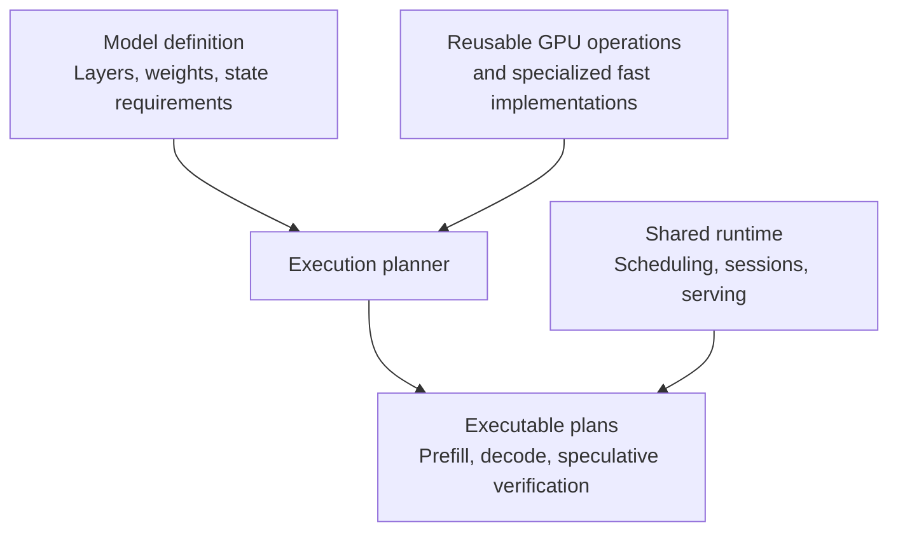

# Gufo model modularity: redesign ideas

Status: partially implemented on `experiment01` (2026-10-02). Changes 3–5 are
substantially done; changes 1–2 are started at the scalar-op and dispatch
level, with the GPU execution planner still future work. See
[docs/plans/model-modularity.md](docs/plans/model-modularity.md) for the
implementation log and measured validation results.

Legend used below: ✅ done · 🟡 partially done · ⬜ not started.

A deeper redesign could make adding models substantially easier. The biggest
change would be to separate **the model's mathematical definition** from **the
machinery that executes it efficiently on Strix Halo**.

Gufo already has a useful serving boundary in
[`TextModelRunner`](src/cli/serve/text_model_runner.hpp). Extending that separation
down into execution would let a model author mostly describe layers, weights and
state requirements.

Conceptually:

The redesign would center on five changes.

**1. Make architectures compositions of reusable operations.**

A model definition would assemble operations such as embeddings, normalization,
attention, recurrent updates, dense or expert feed-forward layers, and output
projections.

Gemma could express its alternating attention types and normalization placement.
Qwen could express its combination of recurrent and attention layers. Each would
have its own small architecture implementation, using shared components.

These definitions could be ordinary C++ code that builds an execution graph. The
definitions must preserve precise mathematical details: attention masks,
positional encoding, scaling, activation variants and accumulation precision.
Those details determine whether reuse is correct.

Once an operation exists, later architectures using it can reuse that support.

🟡 Started: `src/models/common/ops/` holds canonical scalar ops (RMSNorm,
L2Norm, Sigmoid, SiLU, Softplus, SwiGLU, Softmax, NeoX RoPE) with an exactness
contract (`ops/README.md`) and analytic tests. The Flash-Next CPU oracle
forwards to them, pinned bit-exact by recorded checksums. Two deliberate
non-adoptions are documented: Qwen's norm uses a float64-epsilon variant and
its reference SiLU uses divide-form `x/(1+exp(-x))` vs multiply-form, which
round differently. Composing whole architectures from reusable ops (the graph
level above scalar math) is still future work.

**2. Put performance specialization behind those operations.**

The execution planner would select implementations according to tensor shapes,
quantization, hardware and workload:

- Matrix-vector kernels for individual-token decoding.
- Matrix-matrix kernels for prompt processing and larger batches.
- Fused kernels where combining operations saves memory traffic.
- Specialized implementations for particular blocks or architectures.

Most selection and memory planning would happen at model load or when preparing a
new batch shape. The resulting plan could use Gufo's existing style of HIP graph
capture.

This creates a useful progression: a new architecture can first run through
correct, general implementations, then receive targeted optimizations. A
hand-tuned whole-block implementation would remain an option where it provides a
measured benefit.

That preserves room for Gufo's hardware-specific work. Moving kernels behind an
interface alone would not guarantee equal performance; execution plans would
still need measurement.

🟡 Started, GPU side deferred: per-model HIP kernels stay model-private (no
cross-model GPU reuse, per blast-radius policy). `bench --generic` routes
through the registered package as the correct-but-unoptimized baseline, and
targeted tuning stays behind the package. A shape/dtype dispatching GPU
backend is intentionally deferred until a second model needs the same op —
building the dispatcher before then would be speculative generality.

**3. Treat inference state as a core abstraction.**

This is probably the hardest and most valuable part.

Different architectures maintain different kinds of state:

| State | What the runtime needs to understand |
|---|---|
| Full-attention KV cache | Append, share prefixes, restore positions |
| Sliding-window cache | Eviction and recovery of overwritten entries |
| Recurrent state | Checkpoints of accumulated state |
| Speculative decoding state | Commit accepted tokens and undo rejected work |
| Multimodal context | Encoded inputs, positions and their relationship to tokens |

The shared runtime would manage memory budgets, lifetimes and scheduling. State
components would implement their own restore, fork and rollback behavior.

For example, rewinding a recurrent layer requires restoring its accumulated
state. Merely changing the token position is insufficient. Making that contract
explicit would let scheduling and speculative decoding support grow without
repeatedly embedding architecture knowledge in the server.

✅ Done: the contract is documented on `TextModelRunner` itself
(`src/cli/serve/text_model_runner.hpp`) — token-count positions, immutable
exact snapshots, restore-means-restore, speculative commit/rollback inside the
runner with byte-identical greedy output, multimodal identity in the prompt
context, honest capability advertisement — and is enforced by the validation
harness (change 5).

**4. Give every model a complete integration package.**

A model package would contain:

- Architecture definition and configuration validation.
- Weight-name mapping, tensor transformations and format requirements.
- Tokenizer, prompt formatting and output parsing.
- Optional vision components and draft-model integration.
- Capability declarations and reference fixtures.

One registration would expose that package to `serve`, `prompt` and `bench`.

✅ Done: `TextModelPackage` (`src/models/common/model_package.hpp`) +
`TextModelRegistry` implement exactly this — name, architectures,
`ValidateTemplate`, `NativeContext`, `ValidateLoadOptions`, `Load` — with
the Qwen/DeepSeek/Flash-Next runners moved into per-model
`serve_runner.cpp` files and `inference_backend.cpp` slimmed from ~3,500 to
~700 lines as a thin dispatcher. `bench --generic` / `prompt --generic`
work through registration alone.

Output parsing deserves particular attention. At the time of this review, Gufo's
shared inference code contains reasoning accounting based on `</think>`. A broader
design would let the model package interpret its delimiters and emit common
events such as text, reasoning and tool calls. The HTTP layer would serialize
those events. See the
[current inference backend](src/cli/serve/inference_backend.cpp).

✅ Done via `OutputDialect`: each package declares its reasoning delimiters
and tool-call protocols in its runner descriptor; `openai_chat.cpp` parses
through the loaded model's dialect (defaults preserve today's `<think>` +
Qwen/DSML behavior, covered by dialect parity tests). A new dialect no
longer touches shared HTTP code.

Weight storage would also be separate from architecture: supporting a model's
math and supporting a particular quantization are distinct capabilities.

**5. Make validation part of the model integration interface.**

Each package would provide fixtures for a common harness: tokenization, prompt
rendering, reference logits, perplexity, state restoration and streaming behavior.

That makes addition easier in a practical sense: a developer gets a repeatable way
to establish correctness and locate the first divergent layer. Optimized
implementations would be checked against independent references, with explicit
numerical expectations.

✅ Done: `src/models/common/validate/` drives tokenize determinism,
render-and-tokenize, single-vs-multi decode equivalence, and
snapshot/restore fidelity purely through the package interface, reporting
the first divergent check by name. Flash-Next passes 4/4 on real weights
with MTP. Full-logit numerical truth deliberately stays model-specific:
`bench --logit-eval` remains a per-model harness (generalizing it would
force every model into one numerical frame), and the refactor was proven by
bit-identical full logits vs the pre-refactor binary (1664 rows × 2
schedules, hash-equal).

With those foundations, the work for a new model would look like this:

| New model introduces... | Expected work |
|---|---|
| Different sizes of an existing architecture | Configuration, weight mapping and validation |
| A new arrangement of supported operations | Architecture definition and protocol integration |
| A genuinely new mathematical operation | That operation, its state behavior and a backend implementation |
| New performance bottlenecks | Targeted kernel or execution-plan tuning |

There are established precedents for both parts of this design: vLLM encourages
architecture implementations to reuse shared attention and expert layers, while
TVM separates model representation from hardware translation. See the
[vLLM integration guide](https://docs.vllm.ai/en/latest/contributing/model/basic/)
and [TVM architecture](https://tvm.apache.org/docs/arch/index.html).

The preferred target would be **a compact inference runtime with composable model
definitions and replaceable optimized implementations**. For Gemma, success would
mean most new code lives in its model package, with shared-engine changes limited
to genuinely missing operations or state capabilities. That is an achievable
architectural objective; automatic support for every future model would remain
beyond what such a redesign can promise.

## Remaining work (in suggested order)

1. ⬜ Prove the package pays off with a second adopter: move one more
   model family (DeepSeek or the Qwen fallback path's runner) fully behind
   the interface and confirm `serve`/`bench`/`prompt` need no shared-code
   changes — or port a genuinely new architecture (e.g. Gemma) and measure
   how much code truly lives in its package.
2. ⬜ GPU execution planner (change 2's second half): introduce
   shape/dtype dispatch behind shared ops only when two models need the
   same GPU op; keep per-model kernels the default until then.
3. ⬜ Architecture-as-composition (change 1's second half): execution-graph
   building above scalar ops, so a new arrangement of existing ops needs no
   new kernels.
4. ⬜ Weight storage vs architecture split: quantization support declared
   as a capability separate from the model's math.
5. Ongoing: every shared-op adoption must keep the bit-exact parity
   checksums green and re-run matched-token logit comparison against a
   recorded baseline before landing.
